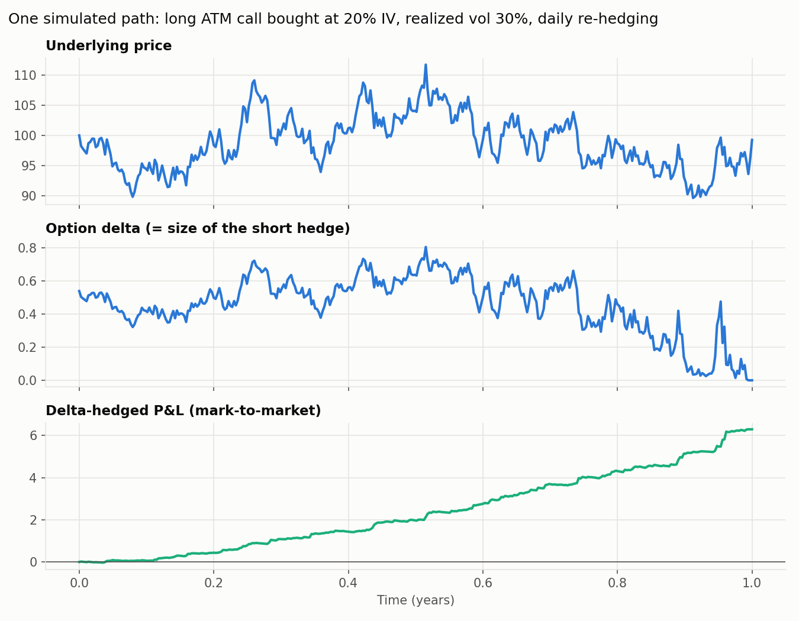
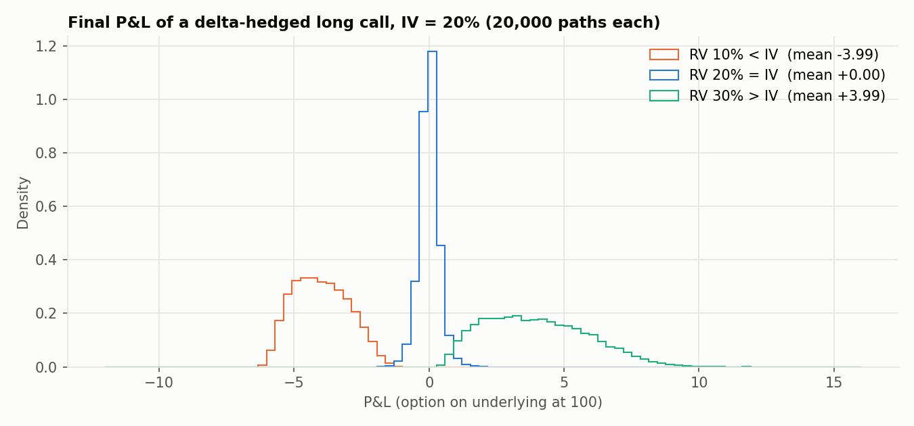
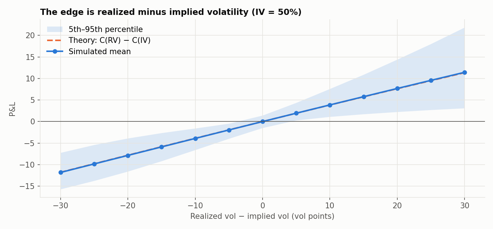
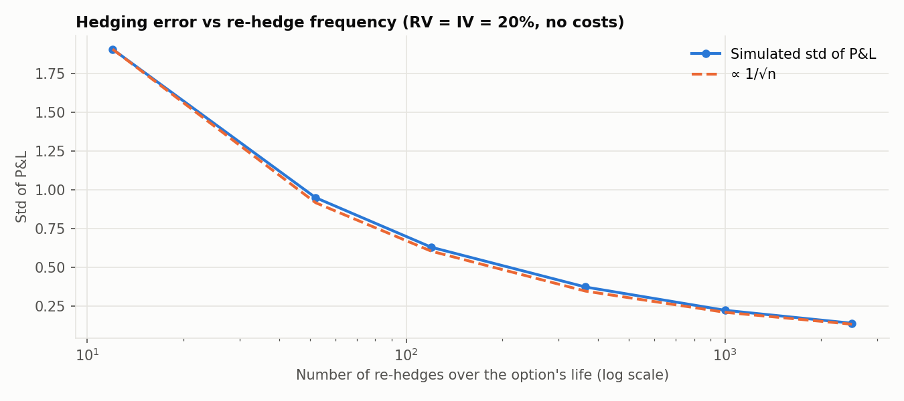

# Gamma Scalping: Trading Realized vs Implied Volatility

[](https://github.com/ivanvgreiff/gamma-scalping-algorithm/actions/workflows/tests.yml)

A research project on **gamma scalping** (dynamic delta hedging of a long option) applied to **BTC options on Deribit**.

The project has four parts:

1. **Theory.** A derivation of where the P&L of a delta-hedged option comes from.
2. **Monte Carlo engine.** A vectorized simulator with a self-financing cash account and P&L attribution, used to check the theory numerically. It is covered by unit tests.
3. **Data and volatility models.** A pipeline for about 6 years of Deribit option trades and Binance BTC spot data, plus realized-volatility estimators and a GARCH forecaster.
4. **Real-data backtest.** Threshold-based delta hedging of actual Deribit BTC options on hourly spot data, with commissions and slippage.



## The idea

Buy an option and short $\Delta$ units of the underlying. That leaves the position with no exposure to the direction of the price, but it keeps **gamma**. Each time you re-hedge, you sell after the price rises and buy after it falls, which earns money from volatility. In exchange, the option loses value every day (theta).

With Itô's lemma and the Black–Scholes PDE priced at implied vol $\sigma_{\text{imp}}$, the instantaneous P&L of the hedged position is:

$$
d\Pi_t = r\,\Pi_t\,dt + \tfrac{1}{2}\,\Gamma_t S_t^2\left(\sigma_{\text{real}}^2 - \sigma_{\text{imp}}^2\right)dt
$$

**You make money exactly when realized volatility exceeds the implied volatility you paid.** The whole strategy therefore comes down to forecasting $\sigma_{\text{real}} - \sigma_{\text{imp}}$. The full derivation is in [`notebooks/gamma_scalping_analysis.ipynb`](notebooks/gamma_scalping_analysis.ipynb).

## Results (simulation)

All results use GBM paths with an ATM call, $S_0 = K = 100$, $T = 1$ year and $r = 0$.

**1. The sign of the P&L follows RV − IV.** At RV = IV the mean P&L is about 0 (pure replication). At ±10 vol points it is ±3.99, compared with the Black–Scholes value $C(30\%) - C(20\%) = 3.95$.



**2. The expected P&L matches theory across the whole range.** The simulated mean stays within 0.09 of $C_{BS}(\sigma_{\text{real}}) - C_{BS}(\sigma_{\text{imp}})$ everywhere. The dispersion of outcomes is large, though. Even with a correct vol view, a single trade can lose money when RV is only slightly above IV.



**3. Discrete hedging adds noise but no bias.** The standard deviation of the hedging error falls as $1/\sqrt{n}$ in the number of re-hedges. With transaction costs this becomes a trade-off, because more hedging reduces variance but raises costs. The notebook sweeps this and reports mean, std, costs and Sharpe ratio for each hedge frequency.



These properties are checked by the test suite in [`tests/`](tests). To regenerate the figures, run `python scripts/make_figures.py`.

## Real-data backtest (work in progress)

[`notebooks/real_data_backtest.ipynb`](notebooks/real_data_backtest.ipynb) runs the strategy on real market data. For each strategy variant, it:

1. Loads Deribit BTC options and Binance BTC hourly spot prices for a chosen window (Jan–Mar 2025 in the notebook).
2. Selects ATM options with about 30 days to expiry.
3. Backs out implied volatility from traded option prices.
4. Delta-hedges each position whenever the net delta exceeds a threshold (2.5%–15% variants).
5. Reports P&L attribution, hedge counts and costs.

The logic lives in [`data/data_loader.py`](data/data_loader.py), [`simulation/gamma_scalping_simulator.py`](simulation/gamma_scalping_simulator.py), [`backtest/backtest_engine.py`](backtest/backtest_engine.py) and [`strategies/gamma_scalping.py`](strategies/gamma_scalping.py). The results have not been validated yet. Treat them as a starting point, not as evidence of an edge.

## Repository structure

```
├── notebooks/
│   ├── gamma_scalping_analysis.ipynb         # main notebook: theory, MC engine, sweeps, P&L attribution
│   ├── synthetic_gamma_scalping.ipynb        # replication vs mispricing, component breakdown
│   ├── synthetic_gamma_scalping_single.ipynb # one path, step by step: gamma vs theta P&L
│   ├── volatility_inspection.ipynb           # RV targets, close-to-close / Parkinson / Rogers–Satchell, GARCH
│   └── real_data_backtest.ipynb              # threshold hedging of real Deribit options (WIP)
├── simulation/
│   ├── monte_carlo.py                        # vectorized delta-hedging MC engine (synthetic GBM)
│   └── gamma_scalping_simulator*.py          # per-option simulator on real data
├── models/
│   ├── options_pricing.py                    # Black–Scholes price, Greeks, implied-vol solver
│   └── volatility/                           # RV target, RV estimators, GARCH(1,1) forecaster
├── backtest/, strategies/                    # backtest config/engine and portfolio runner
├── data/
│   ├── data_loader.py                        # loads parsed spot + per-option data
│   └── scripts/                              # download → parse → bar-building pipeline
├── scripts/make_figures.py                   # regenerates docs/figures
└── tests/                                    # pricing + Monte Carlo sanity tests (run in CI)
```

## Data

The data is not committed because it is about 3 GB. The pipeline in [`data/scripts/`](data/scripts) rebuilds it:

| Step | Script | Output |
|---|---|---|
| 1 | `1_download_data.py` | Daily Deribit BTC option trades and Binance BTCUSDT 1h klines (2019-03 → 2025-07) |
| 2 | `3_parse_options.py` | One folder per instrument (~73k options) with `trades.feather` and metadata |
| 3 | `3_build_option_bars.py --interval 1h` | OHLCV / VWAP bars per option |
| 4 | `3_parse_spot.py` | `data/parsed/spot/BTCUSDT_1h.feather` |

## Getting started

```bash
pip install -r requirements.txt
pytest -q                                   # sanity-check pricing and the MC engine
jupyter lab notebooks/gamma_scalping_analysis.ipynb
```

The simulation notebooks are self-contained and need no data. `volatility_inspection.ipynb` and `real_data_backtest.ipynb` need the parsed data (see above). Most charts are interactive Plotly figures, so run the notebooks locally to see them, because GitHub does not render Plotly output.

## Next steps

- **Volatility forecasting:** add HAR-RV (daily/weekly/monthly RV terms) and HAR + IV, evaluated walk-forward with QLIKE against the GARCH and naive baselines.
- **Signal-driven backtest:** only buy options when the forecast RV exceeds IV, and validate the real-data P&L attribution.
- **Variance risk premium:** measure how often historical Deribit IV exceeded the RV that followed.

## Credits

A team project from [QuanTUMunich](https://github.com/QuanTUMunich) by [ivanvgreiff](https://github.com/ivanvgreiff), Thoran Tschoepe, Lapo Mazzari and contributors. MIT licensed, see [LICENSE](LICENSE).
